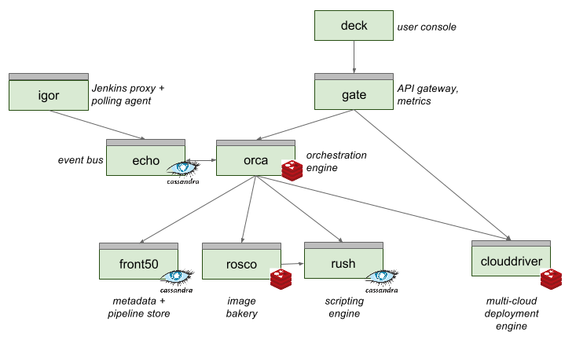

* Table of contents. This line is required to start the list.
{:toc}

#Developer's Guide

This is a preliminary guide for developers. Please check back soon as
we plan to update it in the coming weeks.

##Installation

Please follow the README instructions in the [Spinnaker GitHub
repo](https://www.github.com/spinnaker/spinnaker) to install (and
run!) Spinnaker from source code.

##Spinnaker Components

Spinnaker is composed of the following micro services:

* [Clouddriver](https://www.github.com/spinnaker/clouddriver) - encapsulates all cloud operations.
* [Deck](https://www.github.com/spinnaker/deck) - User Interface.
* [Echo](https://www.github.com/spinnaker/echo) - event service that forwards events from Spinnaker. Echo is responsible for triggering pipeline executions and forwarding pipeline events to listeners.
* [Front50](https://www.github.com/spinnaker/front50) - data store for pipelines, notifications and applications.
* [Gate](https://www.github.com/spinnaker/gate) - service gateway responsible for providing an API to end users and UI. 
* [Igor](https://www.github.com/spinnaker/igor) - interface to Jenkins, Stash and Github.
* [Orca](https://www.github.com/spinnaker/orca) - orchestration engine responsible for running Spinnaker pipelines and tasks.
* [Rosco](https://www.github.com/spinnaker/rosco) - bakery responsible for creating images for deployment.
* [Rush](https://www.github.com/spinnaker/rush) - general purpose scripting engine.

# Jenkins Integration

Spinnaker integrates with Jenkins via the [Igor](https://www.github.com/spinnaker/igor) microservice.

Most commonly, jenkins builds are integrated into Spinnaker as either pipeline triggers or jenkins stages.

* *Pipeline triggers* launch a pipeline execution when a jenkins build has finished.
* *Jenkins stages*, in contrast, launch new jenkins job executions at specific points in the Spinnaker pipeline. 

## Configuration

Igor serves as an interface to multiple jenkins hosts. To configure the list of jenkins masters, you need to modify the igor.yml file that contains the configurations.

Below is an example of two jenkins hosts configured for use in Spinnaker:

~~~
jenkins:
  masters:
    -
      address: "http://spinhost.builds.example.net/"
      name: spinnakerhost
      password: f5e42494586b86687399aa5780eb2222
      username: foo
    -
      address: "http://spinhost2.anotherexample.net/"
      name: anotherhost
      password: a56761f6a117022008e3c44396937f24
      username: bar
~~~

In this example, we have two jenkins hosts. These will appear as *spinnakerhost* and *anotherhost* wherever the Spinnaker UI allows you to select a jenkins host. 

The username and password combination are used to identify the user accessing the jenkins host via its API. The user should have permissions to post new jobs if jenkins stages are being used in pipelines. 

Although Spinnaker allows you to specify the password you use to login to your Jenkins host, we recommend using an API token to access your build. The API token can be retrieved after login on your jenkins server through http://[my.jenkins.host]/user/[username]/configure. The value is under the heading "API Token".
